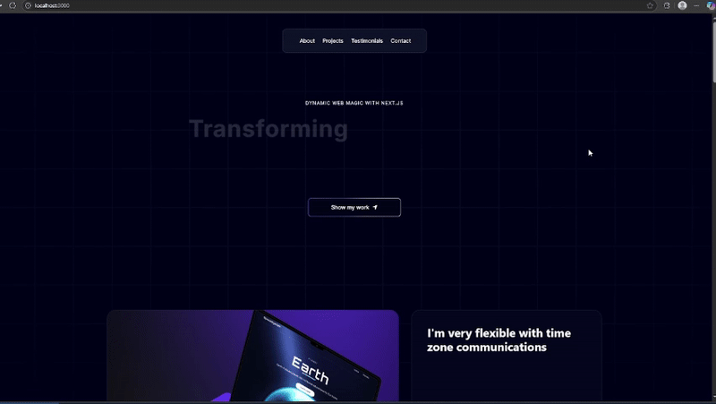
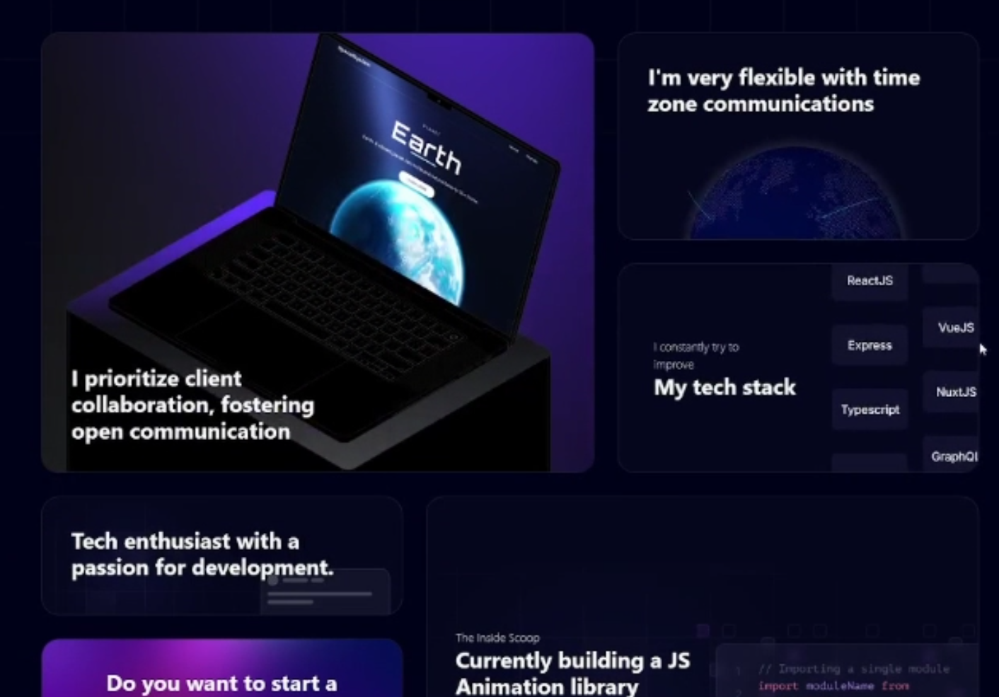
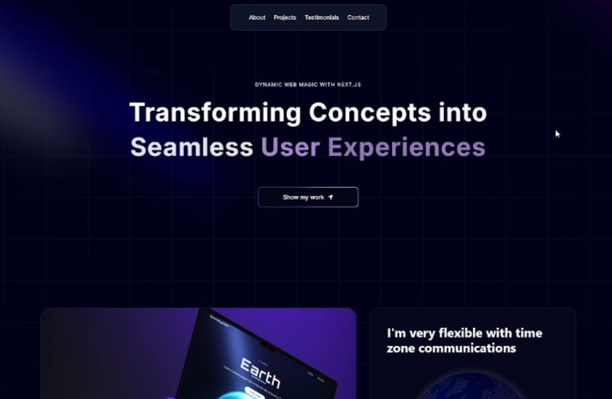

# **🚀 Developer Portfolio (Next.js, Three.js, Framer Motion, TailwindCSS)**

A visually stunning **portfolio** built with **Next.js** for handling the UI, **Three.js** for rendering 3D elements, **Framer Motion** for animations, and **TailwindCSS** for styling. This project showcases the developer's skills in an engaging and impactful way.

---

## 📷 Preview

## **🛠️ Tech Stack**

- **Next.js** – React-based framework for server-side rendering.
- **Three.js** – WebGL-powered 3D graphics in the browser.
- **Framer Motion** – Intuitive animation library for React.
- **TailwindCSS** – Utility-first CSS framework for rapid UI styling.

---

## **✨ Features**

✅ **Hero Section** – Captivating intro with a spotlight effect and dynamic background.  
✅ **Bento Grid Layout** – Modern UI presenting personal details in a visually engaging format.  
✅ **Interactive 3D Elements** – GitHub-style globe and hover effects for depth and interactivity.  
✅ **Testimonials Section** – Animated scrolling testimonials for a sleek user experience.  
✅ **Work Experience Display** – Professionally showcases career achievements.  
✅ **Canvas Effects** – Stunning HTML5 Canvas visual effects for unique design elements.  
✅ **Fully Responsive** – Seamless adaptability across all devices.

🔹 **Additional Enhancements**: Optimized code architecture and reusable components.
